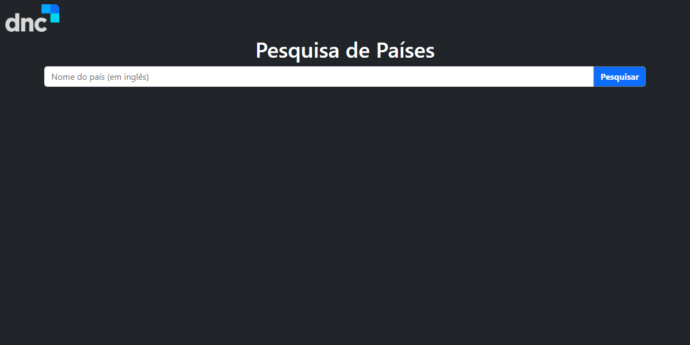
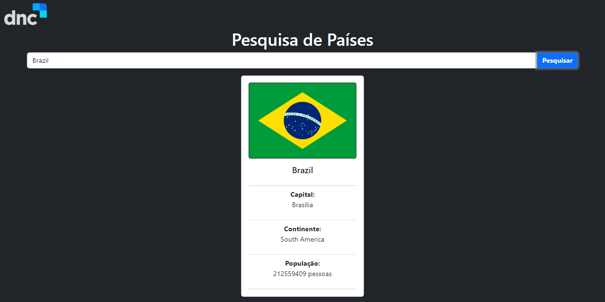

# Pesquisa de Países
Este projeto consiste em uma página web que permite ao usuário pesquisar informações sobre um país e exibi-las em um card na tela. As informações incluem o nome do país, sua capital, continente, população e bandeira.

## Tecnologias Utilizadas
- HTML
- CSS
- JavaScript
- Bootstrap
- API do Rest Countries

## Como Utilizar
Abra o arquivo index.html em um navegador web.

  

 
Digite o nome do país desejado no campo de pesquisa e pressione "Enter" ou clique no botão "Pesquisar".
As informações sobre o país serão exibidas no card na tela.

  

### Contribuição
Este projeto é de código aberto e contribuições são bem-vindas. Para contribuir, siga as seguintes etapas:

1. Fork este repositório.
2. Crie uma branch para sua funcionalidade (git checkout -b feature/suaFuncionalidade).
3. Faça suas modificações.
4. Commit suas mudanças (git commit -m 'Adicionando nova funcionalidade').
5. Push para a branch (git push origin feature/suaFuncionalidade).
6. Abra um Pull Request.

## Licença
Este projeto é licenciado sob a licença MIT. Veja o arquivo LICENSE para mais detalhes.
